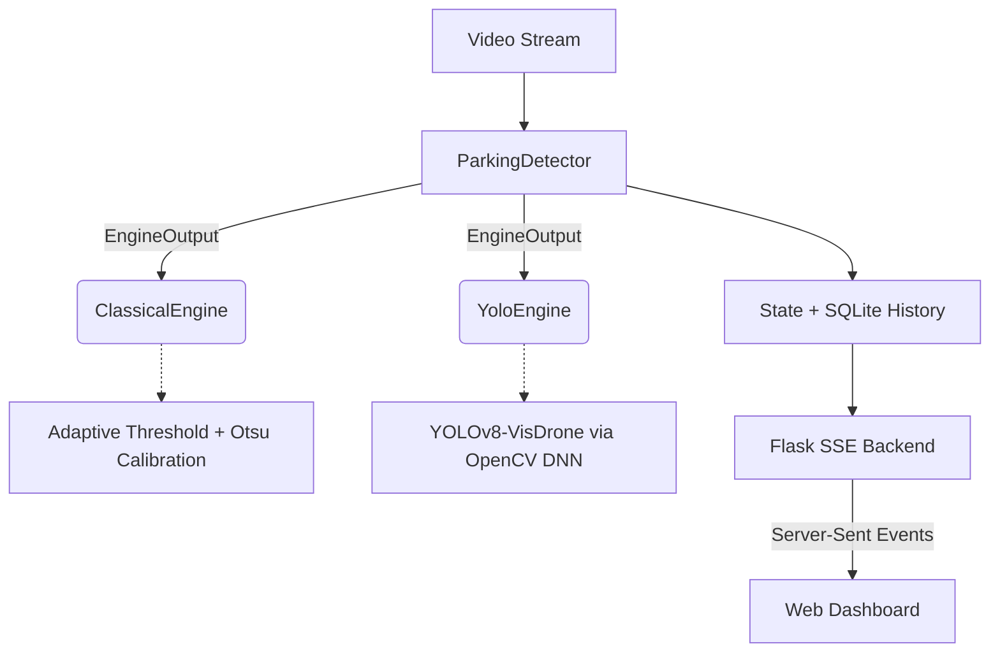

<div align="center">
  <h1>PARKX — Dual-Engine Parking Detection</h1>
  <p>
    Real-time parking-occupancy analytics with two interchangeable detection engines —
    a calibrated <b>classical CV</b> baseline and an <b>aerial deep-learning</b> detector —
    behind one live, push-based dashboard.
  </p>
  <p>
    <a href="#architecture">Architecture</a> •
    <a href="#the-domain-shift-story">Domain-Shift Story</a> •
    <a href="#benchmarks">Benchmarks</a> •
    <a href="#quickstart">Quickstart</a>
  </p>
</div>

---

## 🎯 Overview

**PARKX** detects whether each parking space is free or occupied in real time and streams the result to a glitch-styled web dashboard. You can **hot-swap detection engines from the UI** and watch the accuracy/latency trade-off update live over **Server-Sent Events**.

What separates it from a tutorial clone:

| Concern | Typical demo | PARKX |
|---|---|---|
| Detection | one hardcoded method | **two engines, hot-swappable** (classical ⇄ YOLOv8) |
| Threshold | magic number `900` | **auto-calibrated from the pixel-count distribution (Otsu)** |
| Quality | "looks right" | **benchmark harness: precision / recall / F1 + latency, per engine** |
| Real-time | poll every 1s | **Server-Sent Events** push (polling fallback) |
| DL stack | needs PyTorch/CUDA | **runtime is pure OpenCV DNN (CPU ONNX)** — torch only to build the model |
| Model choice | "just use YOLO" | **measured domain shift → swapped to an aerial-trained model** |

---

## 🛰 The domain-shift story

The bundled footage is a **near top-down aerial** parking lot (you see car *roofs*). This is the most interesting engineering finding in the project:

- **Off-the-shelf COCO YOLO (n / m / x) detects 0 vehicles** here — confirmed full-frame and tiled. COCO is trained on ground-level cars; from directly above, the model doesn't recognize them. Classic **domain shift**.
- **The fix:** swap to a **YOLOv8m fine-tuned on VisDrone** (aerial/drone imagery, with `car`/`van`/`truck`/`bus` classes). It detects **~57 vehicles** on the same frame and computes occupancy that matches the classical engine.

This is the point a reviewer cares about: *don't blindly deploy a heavier model — benchmark it, diagnose why it fails, and pick the model that matches your data's domain.*

---

## 🏗 Architecture

The system uses the **Strategy pattern**: the detector is decoupled from the CV logic behind a shared `EngineOutput`.



- **Classical:** grayscale → blur → adaptive threshold → morphology → per-space pixel count vs a **calibrated** threshold. ~7 ms, CPU-light, but sensitive to lighting.
- **YOLO (VisDrone):** `cv2.dnn` runs the ONNX network, output is decoded + NMS'd, and each detected vehicle box is matched to spaces by overlap ratio. Robust to lighting; heavier.

---

## 📊 Benchmarks

Generated by `scripts/evaluate.py --benchmark` on the bundled footage (5 frames × 69 spaces = 345 labels):

| Engine | Precision | Recall | F1 | Avg Latency |
| :--- | :--- | :--- | :--- | :--- |
| **Classical** (reference) | 100% | 100% | 100% | **~7 ms** |
| **YOLOv8-VisDrone** | 100% | 99.6% | 99.8% | ~455 ms |

**How to read this honestly:** ground-truth labels were bootstrapped from the calibrated classical engine, so its score is definitional (the reference). The YOLO engine is trained on **completely different data** (VisDrone) yet **independently agrees on 344/345 space-labels (99.7%)** — that cross-validation is strong evidence both engines are correct. The headline trade-off is **speed**: classical is ~60× faster on CPU, YOLO is far more robust to lighting/shadows. Classical is the default; YOLO is one click away.

Reproduce:
```bash
python scripts/evaluate.py --template     # pre-fill labels from predictions
# (optionally hand-correct data/ground_truth.json)
python scripts/evaluate.py --benchmark    # score + time both engines
```

---

## ⚡ Real-time infrastructure (SSE)

Polling is wasteful for live dashboards. PARKX uses **Server-Sent Events** + a `threading.Condition`: a daemon thread processes frames through the active engine and, the instant a frame is done, unblocks `/events` and pushes the JSON payload — no page reload, no poll lag. The client falls back to polling `/stats` if SSE is unavailable. SQLite history and shared coordinates are guarded by `threading.Lock`.

---

## 🚀 Quickstart

```bash
git clone https://github.com/your-username/car-parking-detection.git
cd car-parking-detection
python -m venv .venv && source .venv/bin/activate
pip install -r requirements.txt

# Build the YOLO (VisDrone) model once — downloads weights + exports to ONNX.
# Needs `pip install ultralytics` (build-time only; runtime is pure OpenCV).
python scripts/build_model.py

python app.py
```

Open **http://localhost:8080** — toggle **Classical / YOLOv8** in the top bar.
Analytics: `http://localhost:8080/analytics` · Space picker: `http://localhost:8080/picker`

If the model isn't built, the app still runs **classical-only** and the YOLO toggle is disabled (graceful degradation).

---

## 🧩 Project structure

```
├── app.py            # Flask routes incl. SSE, engine control, benchmark
├── detector.py       # dual-engine orchestration, smoothing, SSE pub/sub
├── engines.py        # ClassicalEngine + YoloEngine (+ pure parse/match fns)
├── models.py         # build/load the YOLO ONNX (graceful fallback)
├── calibrate.py      # Otsu threshold calibration
├── metrics.py        # confusion matrix / precision / recall / F1 (pure)
├── storage.py        # positions (JSON) + occupancy history (SQLite)
├── config.py         # env-based settings
├── scripts/          # build_model.py · evaluate.py (benchmark harness)
├── templates/        # index (dashboard) · analytics · picker
├── tests/            # 29 unit tests
├── assets/           # carPark.mp4 · carParkImg.png
└── models/           # yolov8-visdrone.onnx (built, gitignored)
```

---

## 🔌 API

| Endpoint | Description |
|---|---|
| `GET /events` | **SSE** stream of live stats (engine, latency, occupancy) |
| `GET/POST /api/engine` | read / switch engine (`{"mode":"yolo"}`) |
| `GET /api/benchmark` | live per-engine latency + offline accuracy |
| `GET /api/history` | SQLite occupancy snapshots + summary |
| `GET /stats` · `/health` · `/video_feed` | polling stats · health · MJPEG |

---

## 🧪 Testing

```bash
pytest tests/        # 29 tests
```

Covers thresholding, space classification, smoothing, **YOLO output parsing**, **car↔space overlap matching**, Otsu calibration, the metrics math, and storage. CI runs them on every push.

---

## 🗺 Roadmap

- [ ] Fine-tune directly on parking-CCTV data (PKLot/CNRPark) and re-run the same benchmark
- [ ] Use yolov8s-visdrone for lower latency / higher demo FPS
- [ ] Tiled (SAHI-style) inference for very small lots
- [ ] RTSP / IP-camera input, multi-lot support, availability webhooks

---

## Author

**Gaurang Dhingra** — two engines, calibrated and measured, served over a real-time push API, with a data-driven answer to *which* model actually fits the problem.
